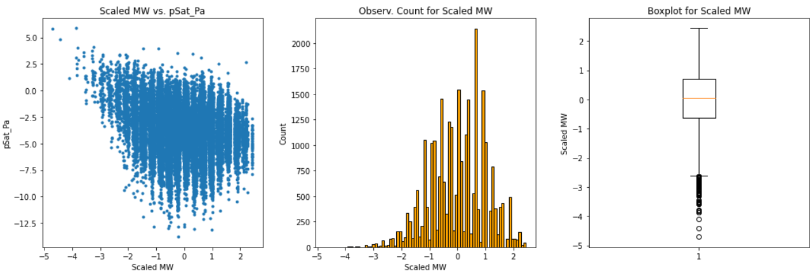
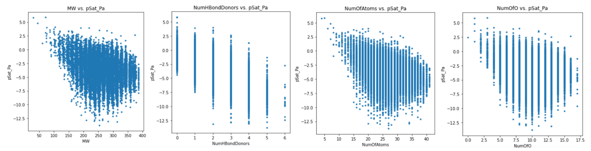
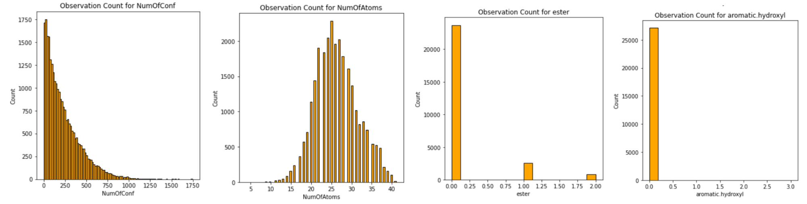
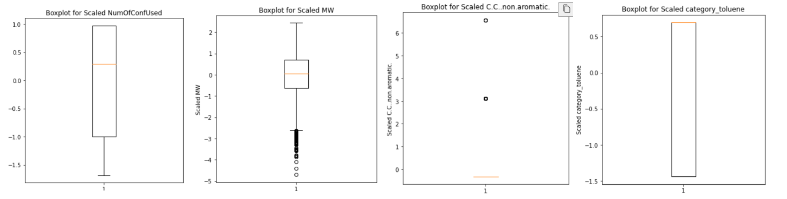

# 1 Introduction

The objective of our project was to build a machine learning model to predict saturation vapour pressure based on some interpretable features. We were given data sets to help us build our model. We started by getting familiar with the data through data exploration and preprocessing. After we had verified that our data was clean, we used it to select our model. Finally, after model selection we applied a few different methods to try and optimize the performance and accuracy of our model. The prediction accuracy was scored based on R2 value. This report contains a more in-depth explanation of our methods regarding the steps of building our model.

# 2 Data analysis

## 2.1 Preprocessing

As a first step to preprocessing we made sure that our data is valid. In other words, we wanted to ensure there are no missing nor mismatched values for any of the variables. This was quite straightforward as Kaggle provided us variable-specific graphs for each variable, meaning we could verify the validity of both the training and test data with the information from Kaggle. We noted that all the data points in both data sets were valid, and thus, the variables did not have missing values.

After validating the data, there were a few minor changes we decided to make to further prepare our data. First of all we decided to remove the 'Id' column from both data sets, as this would not be needed in predicting our target variable. Another thing we did was to apply one-hot encoding for a variable called 'parentspecies', as this was the only categorical variable. This encoding transformed the variable 'parentspecies' into eight binary columns (for example, category_apin, category_apin_decane etc.) for the train set and seven binary columns for the test set. Therefore, after applying one-hot encoding, we needed to create an extra column for the test set to match our training set. 

Lastly we wanted to ensure the data consistency of both training and test data. To do this, we simply compared the two data sets to each other and made sure that both of them have the same columns in the same order. The number of columns in the preprocessed data sets was 32.

## 2.2 Data exploration

The data used in the project is based on GeckoQ dataset. Our first step with the project was to get familiar with this dataset and get a preliminary understanding of the features it has. Our plan was to first use material that was already provided by the project descriptions and then continue with some more data exploration by handling the data ourselves. We first got familiar with the features and their descriptions. Understanding the features perfectly is not necessarily important in this context, however it is useful to have a general understanding of how they might affect our target variable.

### 2.2.1 Scaling considerations

We noticed that the range of values of the variables varied notably. Because we planned to test several models, some of which would perform better with scaled variables, we decided to apply the StandardScaler() on the data sets. We found some information, which claimed that scaling may not be appropriate for one-hot encoded variables. We considered whether we should leave these variables outside of the scaler function. We also found support for applying scaling to one-hot encoded variables to tackle the same challenges that the numerical variables face. Consequently, we tested this matter. Based on the results, not scaling the one-hot encoded variables seemed to have a tiny effect on the R2 score improving the score by around 0.0004-0.0012 for the models we tested, except for Lasso model where the R2 score actually declined by 0.0020. As the effect on the R2 score seemed unsignificant based on this analysis, we ended up using the scaled values also for the categorical variables.

### 2.2.2 Data visualization

To get a better understanding of our data, we created three plots for each of the 32 explainable variables. For each explainable variable, we plotted

i) the explainable variable against our target variable as a scatter plot,

ii) the count of observations per explainable variable value as a histogram, and

iii) the distribution of explainable variable values as a boxplot.

We did this with and without scaling, and concluded that the shape of the graphs, naturally, remains the same, and the only difference is the value of the explainable variables, that is, the x axis. The three graphs for one of the explainable variables (scaled MW) are shown in Figure 1 as an example.

### The scatter plot

Analyzing the first graph, that is, the scatter plot, helped us to understand the relationship of each variable and the target variable better. The scatter plots demonstrated well that there was only one continuous variable while the rest of the variables were discrete (including the one-hot encoded categorical variable). That is, the 'MW' or molecule's molecular weight was the only continuous variable. However, we concluded that this information about discrete vs continuous variables does not guide us to any specific direction or provide any useful insights.

We also noticed that many of the variables had in maximum three different values, so the values were quite concentrated on specific points. Later, this information was used in feature selection, testing the effect of dropping the features with only a few different values. However, feature selection based on these observations did not improve the results. (Feature selection analysis is discussed more in detail in a separate chapter later in the paper.) 

Furthermore, we could observe a somewhat linear relationship for some of the variables, for example, 'MW', 'NumHBondDonors', 'NumOfAtoms', and 'NumOfO' (see Figure 2). Therefore, also including the linear regression model and feature selection based on only these type of features was supported. However, linear regression model or feature selection based on these observations did not improve the results. 

### The histogram

Analyzing the second graph, that is, the histogram, helped us to observe the occurrence of the various variable values. A selection of these different histograms is shown in Figure 3. We noticed the histograms of the various variables remarkably differed from each other. Some of the count distributions reminded us of a half or full normal distribution while in the other extreme the values were concentrated around only one value. We tested selecting only the features that were not too concentrated on a single value. However, these tests did not improve the results either.

### The boxplot

The third graph, that is the boxplot, complemented well the first two graphs. As expected, the distributions of the (scaled) values notably differed from each other. We noticed that some distributions did not have any outliers while others had plenty of them (two graphs on the left in Figure 4). The variables, which were concentrated around a single value, demonstrated this behavior also in the boxplot; outside of the single value there were only outliers (third graph from the left in Figure 4). Furthermore, we noticed that from the one-hot encoded categorical variable, the category_toluene seemed to be the only one with a remarkable amount of two values (the graph on the right in Figure 4). Due to this observation, we tested to drop the other categorical variables (except for category_toluene) to see the effect on the results. However, the results slightly deteriorated with this change, so dropping the one-hot encoded variables was not supported.

### 2.2.3 Outlier considerations

The observations from the boxplots encouraged us to test dropping outliers from the data set.

First, we did this by dropping all the rows with at least one outlier based on the distance from the first quartile (Q1) or the third quartile (Q3); we defined the distance as a multiplier (for example, 1.5) times the interquartile range (IQR). However, this analysis did not improve the results because the number of the resulting rows was in the magnitude of 10% of the original number of rows. This analysis helped us to understand that there seemed to be a trade-off between the number of rows in the data set and excluding the outliers from the data set. Because this approach did not work well for our purposes, we tested another approach to drop outliers based on a threshold for z score.

We tested dropping out rows which included at least one variable that could be regarded as an outlier based on a threshold level (tested a threshold range from 2 to 4). That is, a variable that had a z score higher than the threshold level was considered as an outlier. The results made more sense because the number of rows in a data set after removing the outliers varied from 10,561 (z<2) to 25,166 (z<4). However, the conclusions were the same; a larger number of rows in the data set overweighted any benefit received from removing outliers with this method for most of the models. Worth noting is that for the OLS Linear Regression model, the R2 score slightly increased when moving from a threshold level 4 to 3; regardless, the R2 score of this model was below SVR, so it would not be worth removing outliers from the data set based on this method.

## WHAT DOES THIS REFER TO? In addition, we compared the distributions of variable values for both train and test data. This would turn out useful in selecting the features for our model.

# 3 Methods

The methods discussed in this section aim to improve the model R2 score in the Kaggle competition. However, the evaluation of the model optimization process for the Kaggle competition turned out to be challenging, as the R2 score in Kaggle did not correlate with local results. The cross-validated R2 score was locally at best varying between 0.71 and 0.76, while the results in Kaggle were between 0.62 and 0.66. The changes in the R2 score were often somewhat marginal both locally and in Kaggle, which made it difficult to evaluate the true effect of the changes. We were informed later that the test data we had for the Kaggle competition was actually skewed when compared to the training data. This could explain at least part of the differences we had in the results. In order to stay consistent, the R2 scores discussed in this and the latter sections were obtained locally with the cross-validation method.

## 3.1 Model selection

We started out by comparing different regression models on the preprocessed training data. Recall that in the preprocessing step we applied one-hot encoding on the *parentspecies* and did not yet drop any features apart from the *Id* column meaning that we had 32 features in total. Initially, we tested with OLS Linear Regression, Random Forest, Support Vector Regressor, Lasso Regression and eXtreme Gradient Boosting. Later, we also added MLP Regression and Elastic Net to the comparison. At this point, we did not set any model parameters apart from the random seed. We used cross-validation (k=5) to evaluate the R2 scores and fitted the models with and without scaling. The models that clearly benefited from the scaling were SVR and MLP. For Lasso and Elastic Net, the results actually worsened with scaling and for OLS Linear Regression, Random Forest and XGBoost the results remained more or less the same. The full results are presented in section 4. At this stage, we obtained the best overall R2 score with MLP (0.7421) and SVR (0.7383) using scaled data. XGBR also performed well (0.7299), and due to its significantly faster performance, we used it in the latter feature engineering phases among the two other best performing models.

## 3.2 Parameter tuning

Next, we tried to improve the performance of the best models by tuning the hyperparameters. We tried using both GridSearch and RandomizedSearch to find the best hyperparameter combinations. For SVR, we tried different kernels (linear, rbf, poly), C values (0.1, 1, 10, 100), epsilon values (0.1, 0.2, 0.5) and gamma values (scale, auto). Unfortunately, we quickly realized that in this case the GridSearch with k=5 cross-validation took too long to run and we had to settle for a small RandomizedSearch and manual selection. In the end, we were able to obtain at least one hyperparameter combination that slightly improved the result for SVR. R2 score of 0.7444 was achieved with C=10 (default 1), kernel='rbf', gamma='scale' & epsilon=0.5 (default 0.1).

With XGBR, we managed to improve the R2 score from 0.7299 to 0.7388 using RandomizedSearch with 20 iterations and k=5 cross-validation. The best hyperparameters were: colsample_bytree=0.983, gamma=0.162, learning_rate=0.166, max_depth=3, min_child_weight=17, n_estimators=596, reg_alpha=0.127, reg_lambda=0.123 & subsample=0.848. We tried to find the best hyperparameters again after feature engineering phase, but the hyperparameters remained the same. As the MLP model was only added later on, we actually didn't perform any parameter search for it.

## 3.3 Feature engineering

### 3.3.1 Scaling features

### 3.3.2 Feature selection

As already discussed in the data exploration section, there were several features that seemed to have little or no effect on the target variable. These features were such that their value distributions were extremely concentrated on a certain value. We decided to drop these features from the data set. These features included most of the one-hot encoded *parentspecies* variables: *category_None*, *category_apin_decane*, *category_apin_decane_toluene*, *category_apin_toluene* & *category_decane_toluene*. In addition, other such features were *C.C.C.O.in.non.aromatic.ring*, *aromatic.hydroxyl* and *nitroester*. 

We also tried a few different combinations of different features, but the best result was obtained by dropping the features mentioned above. At this point, we were still trying out with both SVR & XGBR and they both had slight increases in their R2 scores. However, it is questionable if the improvements were actually significant since the changes in R2 were so marginal. With the features that were left, it was more difficult to evaluate their effect on the target variable. In the hindsight, we probably could have used some methods to try and evaluate the importance of the other features as well.

**TO BE CONTINUED**

In the end we obtained the best results with SVR using standard scaler, default hyperparameters and the feature selection as described above.

### 3.3.3 Creating new features

### 3.3.4 Transforming features

# 4 Results & conclusions

# 5 Self-grading

